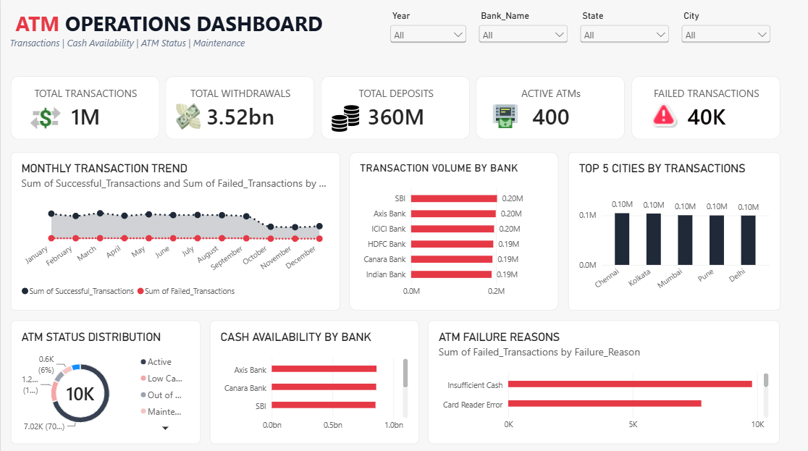

# 🏧 ATM Operations Dashboard

An interactive **Power BI dashboard** designed to analyze ATM operations, transaction activity, service performance, and operational trends.

## 🎯 Project Objective

The objective of this project is to transform ATM operational data into clear business insights using Power BI and interactive data visualization.

## 🛠️ Tools & Technologies

- Power BI
- Power Query
- DAX
- Data Cleaning
- Data Modeling
- Data Visualization

## 📊 Dashboard Analysis

The dashboard provides analysis of:

- ATM transaction activity
- Transaction volume
- Operational performance
- ATM/service trends
- Regional or location-level performance
- Transaction patterns
- Key operational KPIs

## 📌 Key Skills Demonstrated

`Power BI` `DAX` `Power Query` `Data Modeling` `Data Cleaning` `Data Visualization` `Business Intelligence`

## 🖼️ Dashboard Preview

  

## 📁 Project Files

| File | Description |
|---|---|
| `ATM-Operations-Dashboard.pbix` | Power BI dashboard |
| `dashboard-preview.png` | Dashboard preview |

## 💡 Business Value

This dashboard demonstrates how operational data can be transformed into an interactive reporting solution that helps users monitor activity, identify trends, and understand ATM performance.

---

### 👨‍💻 Author

**Ajay Dev**

Data Analyst | Data Scientist

[GitHub](https://github.com/AjayDev007-lab)
